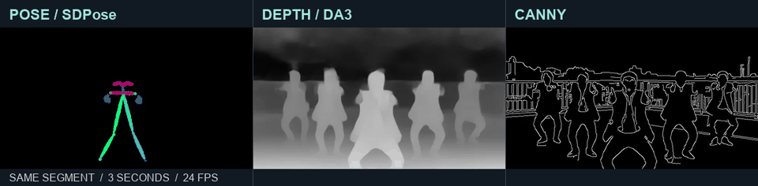
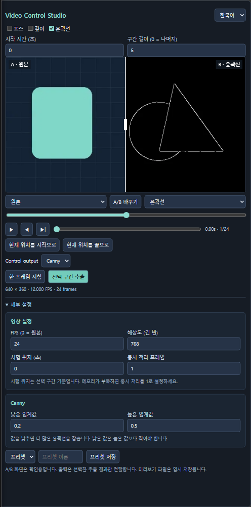

# Video Control Studio

[English](README.md)

비디오에서 Pose·Depth·Canny 참조 영상을 만들고, 같은 프레임을 세로 비교선으로 확인하는 ComfyUI 노드입니다. 기본 UI는 영어이며 노드 오른쪽 위에서 **한국어**로 바꿀 수 있습니다.



**하나의 영상에서 세 가지 제어 영상을 만듭니다.** 왼쪽은 Pose(SDPose), 가운데는 Depth(DA3), 오른쪽은 Canny입니다. 모두 같은 3초 구간을 사용합니다. [24 FPS 비교 영상 보기·다운로드](docs/control-comparison.mp4). 위 미리보기는 12 FPS로 반복 재생하며, 실제 추출과 MP4는 24 FPS입니다.

**MiniMax H3 Fun ControlNet에 연결할 수 있습니다.** `control_frames`(IMAGE)를 **Apply MiniMax H3 Fun ControlNet → control_video**(IMAGE)에 연결하고, **Control output**에서 Pose·Depth·Canny를 선택하세요. [바로 불러올 예제](examples/h3-pose-controlnet-ko.json)와 [공식 노드 입력 안내](https://github.com/Comfy-Org/embedded-docs/blob/main/comfyui_embedded_docs/docs/MiniMaxH3FunControlNetApply/en.md)를 참고하세요. 다른 Fun ControlNet 모델은 지원하는 제어 종류와 생성 설정을 확인해야 합니다.



생성 전에 움직임 참조를 점검하거나 전처리 설정을 비교하고, 다른 워크플로우용 제어 영상을 저장할 때 사용할 수 있습니다. ComfyUI 기본 전처리 기능을 사용하며 로컬에서 실행됩니다.

## 추출 종류 선택

| 종류 | 활용 | 필요한 모델 |
| --- | --- | --- |
| Pose | 원본 외형과 분리해 움직임·제스처 전달 | SDPose Wholebody |
| Depth | 장면 깊이와 사물의 상대적 배치 제어 | Depth Anything 3 |
| Canny | 윤곽선·실루엣·장면 구조 제어 | 없음 |

여러 종류를 선택하면 A/B 화면에서 비교할 수 있습니다. **Control output**으로 전달할 종류는 하나를 선택하며, 체크한 종류만 계산합니다.

## 설치

1. `ComfyUI/custom_nodes`에서 다음 명령을 실행합니다.

   ```sh
   git clone https://github.com/impacifist/ComfyUI-Video-Control-Studio.git
   ```

   또는 [Releases](https://github.com/impacifist/ComfyUI-Video-Control-Studio/releases)에서 압축 파일 하나를 받아 해당 폴더에 풉니다.
2. 기본 **SDPose·Depth Anything 3·Canny·Load Video** 노드가 포함된 최근 ComfyUI를 사용합니다. 해당 ComfyUI 환경 외에 추가 Python 패키지는 필요하지 않습니다.
3. Pose를 쓰려면 [SDPose Wholebody](https://huggingface.co/Comfy-Org/SDPose)의 `sdpose_wholebody_fp16.safetensors`를 `ComfyUI/models/checkpoints/`에 넣습니다.
4. Depth를 쓰려면 [Depth Anything 3 Small](https://huggingface.co/Comfy-Org/Depth-Anything-3)의 `depth_anything_3_small.safetensors`를 `ComfyUI/models/geometry_estimation/`에 넣습니다.
5. ComfyUI를 재시작하고 브라우저를 새로고침합니다. `video/control`에서 **Video Control Studio**를 추가합니다.

Canny는 모델이 필요 없습니다. 모델은 자동 다운로드하지 않으며 배포 파일에도 포함하지 않습니다. 각 모델의 라이선스를 따릅니다. EN·KO 배포 파일은 최초 UI 언어만 다릅니다. 둘 중 하나만 설치하세요. 워크플로우에 저장된 언어 설정이 우선합니다.

## 사용 순서

1. 기본 **Load Video → Video Control Studio**를 연결합니다. VHS의 IMAGE 출력을 쓰려면 FPS와 함께 기본 **Create Video**를 거쳐 연결합니다.
2. 필요한 추출 종류만 선택하고 시작 시간·구간 길이를 정합니다. 길이 `0`은 끝까지입니다.
3. **한 프레임 시험**으로 확인한 후 **선택 구간 추출**로 전체 결과를 확인합니다. 시험 위치는 선택한 구간의 시작을 기준으로 합니다. 시험은 해당 실행에만 적용되며 상단 실행 버튼은 전체 구간을 추출합니다.
4. 영상 위의 세로선을 드래그하고 A/B 종류를 바꿔 비교합니다. 재생·프레임 이동·타임라인 이동·비교선 조작은 추론을 다시 실행하지 않습니다.
5. **ControlNet 출력**을 선택하고 다시 추출합니다. `control_frames`는 IMAGE 배치이며 MiniMax H3 Fun ControlNet의 `control_video` 같은 입력에 연결합니다. 기본 H3 Fun ControlNet Union에는 별도 종류 선택기가 없으며 선택한 맵을 그대로 받습니다. 다른 모델은 해당 맵을 지원하는 ControlNet을 사용하세요. 생성 모델에 맞게 해상도·프레임 수·FPS를 설정하세요.
6. 파일로 저장하려면 `control_video`를 **Save Video**에 연결하고 ComfyUI 상단의 실행 버튼을 누릅니다. 노드 내부 버튼은 이 노드와 입력만 실행하므로 후속 영상 생성·저장 노드를 실행하지 않습니다.

[한국어 예제](examples/video-control-studio-ko.json) 또는 [영어 예제](examples/video-control-studio-en.json)를 불러온 다음 본인의 영상을 업로드하고 Canny부터 시험해 보세요. 예제에는 영상이나 개인 프롬프트가 들어 있지 않습니다. 한 설치본에서 두 언어를 지원하므로 중복 설치할 필요가 없습니다.

## 자주 쓰는 설정

최소 크기는 세부 설정까지 내부 스크롤 없이 표시하도록 조정됩니다. 세부 설정은 처음부터 펼쳐져 있으며, 한국어 UI에서도 **Control output**과 그 선택 항목은 영어를 유지합니다.

영상 생성까지 연결한 [H3 Pose ControlNet 예제](examples/h3-pose-controlnet-ko.json)도 제공합니다. 모델 준비와 연결 방법은 [워크플로우 가이드](docs/WORKFLOWS.ko.md)를 참고하세요.

- **출력 FPS**: `0`은 원본 유지. 다른 값은 프레임을 생략·반복해 맞추며 보간하지 않습니다.
- **최대 변 길이**: 비율을 유지하고 가로·세로를 짝수 크기로 맞춥니다.
- **현재 위치를 시작/끝으로**: 미리보기에서 구간을 고른 후 다시 추출해 적용합니다.
- **세부 설정**: 영상 설정을 한곳에 모으고, 선택한 추출 방식의 옵션만 표시합니다. Pose는 모델·부위·신뢰도, Depth는 모델·반전, Canny는 두 임계값을 함께 배치합니다. 숨겨진 옵션의 값도 유지됩니다.
- **프리셋**: 이름을 붙여 추출 설정을 워크플로우 안에 저장합니다. 모델 선택은 노드 입력에 별도로 저장됩니다. 노드 간 공유 라이브러리는 아닙니다.
- **출력**: `control_frames`는 선택한 제어 맵의 IMAGE 배치, `control_video`는 같은 맵을 담은 무음 VIDEO입니다. `fps`와 `frame_count`도 제공합니다.

비교 화면의 원본이나 비교선은 제어 출력에 섞이지 않습니다. 미리보기는 ComfyUI 임시 폴더에 WebP로 저장되며, 실제 출력은 추출 해상도를 유지합니다. 자신의 워크플로우를 공유할 때는 입력 파일명에 개인 정보가 없는지 확인하세요.

H3에는 24 FPS를 사용하세요. 생성 프레임 수는 `17n + 5` 규칙을 따릅니다. 예를 들어 124프레임은 약 5.17초입니다. 제어 영상이 짧으면 기본 ControlNet이 마지막 프레임을 유지합니다. 5초·24 FPS 추출은 120프레임이므로, 124프레임 전체를 제어하려면 원본과 구간 길이를 충분히 확보하세요.

## 현재 범위

- Pose는 화면 전체를 대상으로 하는 단일 인물 SDPose입니다. 다인물 검출·선택·추적은 포함하지 않습니다.
- Depth는 프레임별 DA3를 쓰고 구간 전체에 같은 역깊이 명암 기준을 적용합니다. 기본값은 가까울수록 흰색입니다. 시간축 안정화는 아니므로 깜빡임이 생길 수 있습니다.
- 길고 큰 영상은 RAM과 임시 디스크를 많이 사용합니다. 배치 크기는 추론 단위만 줄입니다. 짧은 구간과 적당한 해상도로 시작하세요.
- 서브그래프 내부에서는 노드 자체 실행 버튼 대신 ComfyUI 상단 실행을 사용하세요.
- 재시작 후 임시 미리보기가 사라지면 다시 추출하세요.
- ComfyUI 0.37.1 / 프런트엔드 1.52.7에서 검증했습니다. 기본 전처리 노드가 없는 구버전은 지원하지 않습니다. MiniMax H3 영상 생성 자체는 이 노드의 기능이 아닙니다.

[검증 기록](docs/VALIDATION.md) · 패키지 라이선스: MIT. ComfyUI 및 모델은 각자의 라이선스를 따릅니다.

비교 GIF·MP4는 제공된 영상에서 추출한 제어 맵 예시입니다. 원본 영상과 오디오는 포함하지 않으며, 패키지의 MIT 라이선스가 원본 영상에 대한 권리를 부여하지는 않습니다.
