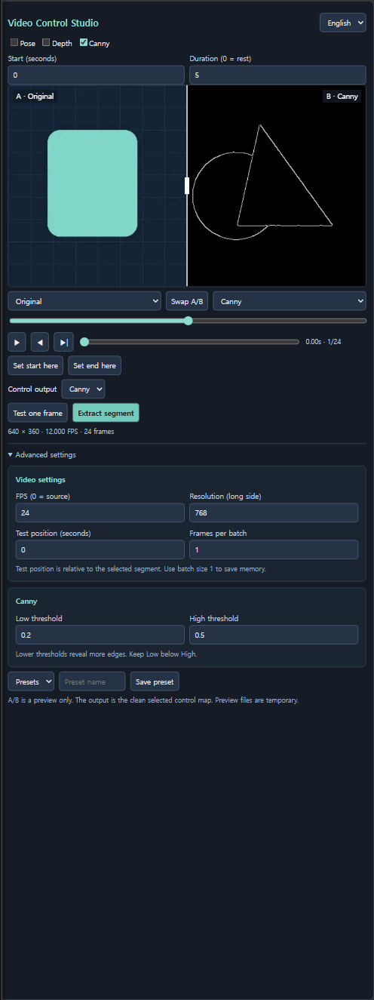
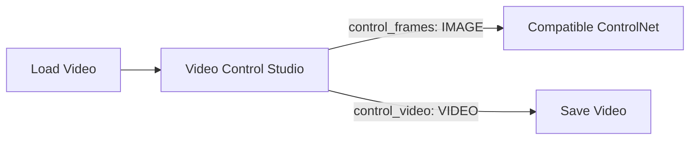

# Video Control Studio

[한국어 안내](README.ko.md)

Prepare control videos inside ComfyUI: select Pose, Depth or Canny, extract a short segment, then inspect the same frame with a draggable A/B divider. 


**One clip, three control maps.** Left: Pose (SDPose), center: Depth (DA3), right: Canny. All three use the same three-second segment. [Watch or download the 24 FPS comparison video](docs/control-comparison.mp4). The inline preview loops at 12 FPS; extraction and MP4 playback use 24 FPS.

**Works with MiniMax H3 Fun ControlNet.** Connect `control_frames` (IMAGE) to **Apply MiniMax H3 Fun ControlNet → control_video** (IMAGE), then choose Pose, Depth or Canny in **Control output**. See the [ready-to-load workflow](examples/h3-pose-controlnet-en.json) and [official node input reference](https://github.com/Comfy-Org/embedded-docs/blob/main/comfyui_embedded_docs/docs/MiniMaxH3FunControlNetApply/en.md). Other Fun ControlNet models require a compatible control type and matching generation settings.



Use it to inspect motion references before sampling, compare preprocessing settings or export a control video for another workflow. Processing uses ComfyUI's native preprocessors and runs locally.

## Choose a control map

| Mode | Useful for | Required model |
| --- | --- | --- |
| Pose | Body motion and gestures, separate from source appearance | SDPose Wholebody |
| Depth | Scene depth and relative object placement | Depth Anything 3 |
| Canny | Outlines, silhouettes and scene structure | None |

Enable several modes to compare them, then select one **Control output**. Only checked modes are processed.



## Install

1. In `ComfyUI/custom_nodes`, run:

   ```sh
   git clone https://github.com/impacifist/ComfyUI-Video-Control-Studio.git
   ```

   Alternatively, extract one archive from [Releases](https://github.com/impacifist/ComfyUI-Video-Control-Studio/releases) into that directory.
2. Use a recent ComfyUI containing native **SDPose**, **Depth Anything 3**, **Canny** and **Load Video** nodes. No additional Python packages are required beyond that ComfyUI installation.
3. For Pose, install [SDPose Wholebody](https://huggingface.co/Comfy-Org/SDPose) (`sdpose_wholebody_fp16.safetensors`) under `ComfyUI/models/checkpoints/`.
4. For Depth, install [Depth Anything 3 Small](https://huggingface.co/Comfy-Org/Depth-Anything-3) (`depth_anything_3_small.safetensors`) under `ComfyUI/models/geometry_estimation/`.
5. Restart ComfyUI and refresh the browser. Add **Video Control Studio** from `video/control`.

Canny needs no model. The node never downloads models automatically; model files are not bundled. Each model retains its own license. Separate EN and KO archives differ only in the initial UI language; install either one, not both. Saved workflow language choices take precedence.

## Use

1. Connect native **Load Video → Video Control Studio**. VHS users can route their IMAGE batch and its FPS through native **Create Video** first.
2. Choose only the extractors you need. Set **Start** and **Duration** in seconds; duration `0` means the rest of the video.
3. Click **Test one frame** for a quick check, then **Extract segment** to review the full control sequence. Test position is relative to the selected segment. The test only changes that local execution; the main Run button still extracts the full segment.
4. Drag the vertical line, select the left/right sources, scrub, step through frames or play. Comparison controls do not rerun inference.
5. Select **Control output** and extract again to change the downstream result. Connect `control_frames` to an IMAGE-based control input, such as MiniMax H3 Fun ControlNet's `control_video`. Native H3 Fun ControlNet Union accepts the selected map without a separate control-type selector. Use a compatible ControlNet for other models. Match the downstream resolution, frame count and FPS to your model's requirements.
6. Alternatively, connect `control_video` to **Save Video** and use ComfyUI's main Run button to export. The node's own buttons run only this node and its ancestors, so they do not execute Save Video or a downstream generator.

Load [English example](examples/video-control-studio-en.json) or [Korean example](examples/video-control-studio-ko.json), upload your own video, and start with Canny. Examples include no media or private prompts. The same node implementation supports both languages; do not install duplicate copies.

## Controls and outputs

For a complete generation example, use the [H3 Pose ControlNet workflow](examples/h3-pose-controlnet-en.json). The [workflow guide](docs/WORKFLOWS.md) explains model requirements, wiring and troubleshooting.

| Control | Behavior |
| --- | --- |
| Pose / Depth / Canny | Only checked extractors run. All selected results are available in A/B. |
| FPS | `0` preserves source FPS. Other values resample by dropping/repeating frames, without motion interpolation. |
| Maximum side | Resize with aspect ratio preserved and even dimensions. |
| Set start/end here | Select a smaller segment from the current preview; extract again to apply. |
| Advanced | Video settings stay together. Only enabled modes show their own settings: Pose model, body parts and confidence; Depth model and inversion; Canny thresholds. Hidden settings retain their values. |
| Presets | Save extraction settings by name inside the workflow. Model choices are stored as node inputs, separately from presets. |
| Layout / language | Minimum size keeps all controls visible without internal scrolling. Advanced settings start expanded. Control output and its mode names remain English in both languages. |
| `control_frames` | Clean selected control maps as an IMAGE batch. |
| `control_video` | The same control maps as VIDEO, with output FPS and no audio. |
| `fps` / `frame_count` | Output timing and length. |

The comparison image is never mixed into the control output. Preview images are temporary WebP files served locally by ComfyUI; actual control tensors retain their full extraction resolution. Sharing a workflow includes its settings and input filename, so remove private filenames before sharing your own workflow.

For H3, use 24 FPS. Its generated frame count follows `17n + 5` (for example, 124 frames = approximately 5.17 seconds). The native ControlNet holds the last control frame when the sequence is shorter than the generated video. A five-second extraction at 24 FPS has 120 frames; choose a long enough source/segment when you need all 124 control frames.

## Limits

- Pose uses native SDPose on the full frame for a single person. It does not detect/track multiple people or let you select a person.
- Depth uses framewise DA3 with one inverse-depth contrast range across the segment (near = white by default). This is not temporal smoothing; depth can flicker.
- Video decoding, extracted tensors and preview files grow with clip length and enabled modes. Batch size limits inference batches, not total RAM. Start with short clips and modest resolution.
- The local run buttons support ordinary top-level nodes. Inside a ComfyUI subgraph, use the main Run button.
- Preview files may disappear after a server restart; extract again. Presets persist in the workflow, not in a shared global library.
- Compatibility verified on ComfyUI 0.37.1 / frontend 1.52.7. Older releases missing native preprocessors are unsupported. This package extracts references; it does not load or run MiniMax H3 itself.

## Validation and license

See [validation notes](docs/VALIDATION.md). Unit checks: `python -m unittest discover -s tests -v`.

MIT for this package. Native ComfyUI implementations and model weights retain their respective licenses. Built on [ComfyUI](https://github.com/Comfy-Org/ComfyUI), [SDPose](https://huggingface.co/Comfy-Org/SDPose) and [Depth Anything 3](https://github.com/ByteDance-Seed/Depth-Anything-3).

The comparison GIF/MP4 demonstrates extracted maps from a user-provided clip; source footage and audio are not bundled. The package's MIT license does not grant rights to the underlying footage.
